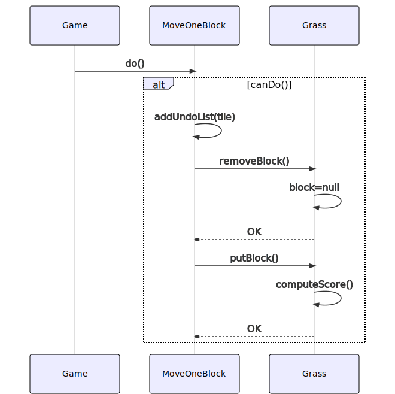
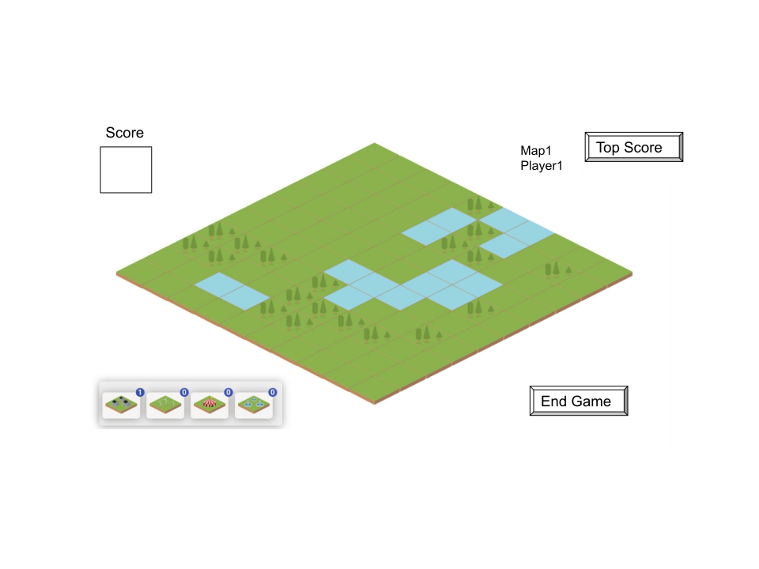

# Rapport Conception

### Diagramme de classes

### Diagramme de séquences

##### Mise d'un block

##### Déplacement d'un block

##### Route REST

### Routes REST

POST /{map}/{player}/{score}
Entrée JSON :
{
"score": 
}

GET /maps
Sortie JSON : 
{
"map1Name":
"map2Name":
}

GET /{map}
Sortie JSON :
{
"map": [
	{
	"name" :
	}
]
}

GET /{map}/scores
Sortie JSON :
{
"score1":
"score2":
}

### Mock-up

##### Accueil

##### Choix de la map

##### Map

##### Fin de partie

